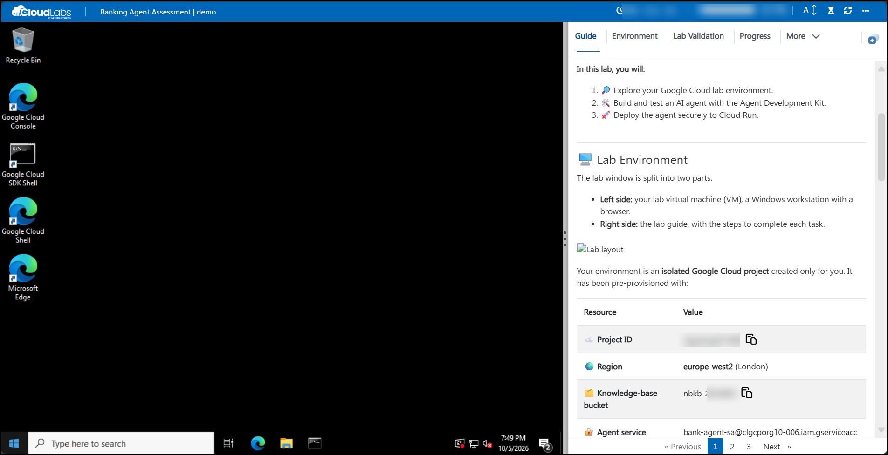
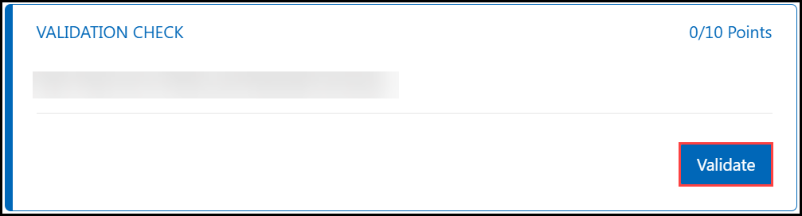

<h1 align="center">🤖 Day 1 Builder: Build Your First Banking Agent</h1>

<b>Fast Lane AI Academy</b> | <b>Builder Pathway</b> | ⏱️ <b>Estimated Timing: 25 Minutes</b> | 🏆 <b>Points: 100</b>

---

## 🎯 About This Lab

Northbridge Bank wants a customer helpdesk assistant that answers questions about its savings and current-account products, using only figures from its approved knowledge base.

In this lab, you build that assistant, **Nova**, with Google's **Agent Development Kit (ADK)** and **Gemini on Vertex AI**. You give it a tool that reads the bank's product catalogue from **Cloud Storage**, test it, and deploy it as a private, secure service on **Cloud Run**.

**In this lab, you will:**

1. 🔎 Explore your Google Cloud lab environment.
1. 🛠️ Build and test an AI agent with the Agent Development Kit.
1. 🚀 Deploy the agent securely to Cloud Run.

---

## 🖥️ Lab Environment

The lab window is split into two parts:

- **Left side:** your lab virtual machine (VM), a Windows workstation with a browser.
- **Right side:** the lab guide, with the steps to complete each task.

Your environment is an **isolated Google Cloud project** created only for you. It has been pre-provisioned with:

| Resource | Value |
|---|---|
| ☁️ **Project ID** | <inject key="ProjectId" enableCopy="true"/> |
| 🌍 **Region** | <inject key="Region" enableCopy="true"/> |
| 🗂️ **Knowledge-base bucket** | <inject key="KbBucket" enableCopy="true"/> |
| 🔐 **Agent service account** | <inject key="AgentServiceAccount" enableCopy="true"/> |

---

## 🧭 Lab Window Controls

| # | Control | Use |
|:---:|---|---|
| 1 | **VM selector** | Shows the lab VM you are connected to. |
| 2 | **Timer** | Time remaining in your lab session. |
| 3 | **Progress bar** | Your progress through the lab. |
| 4 | **A↕** | Change the text size of the lab guide. |
| 5 | **Refresh** | Reconnect the VM if the screen stops responding. |
| 6 | **More (...)** | Language, Delete and VM Native Clipboard options. |
| 7 | **Lab guide menu** | Guide, Environment, Progress, Resources and Help. |
| 8 | **Split window** | Split the lab guide and the VM into separate windows. |

### 6️⃣ More Options

| Option | Use |
|---|---|
| 🌍 **Language** | Switch the lab language, if multi-language support is enabled. |
| 🗑️ **Delete** | Delete the environment once your lab is complete. |
| 📋 **VM Native Clipboard** | Allows copying files within the VM. While it is on, text copied from your local PC cannot be pasted into the VM using keyboard shortcuts. You can turn it off at any time from **More (...)**. |

### 7️⃣ Lab Guide Menu

| Option | Use |
|---|---|
| 📖 **Guide** | All tasks and lab information. |
| 🔑 **Environment** | All required credentials and lab details. |
| 📈 **Progress** | Your points for validations. |
| ⚙️ **Resources** | Start and stop the lab VM. |
| ❓ **Help** | Support information. |

---

## 🔐 Sign In to Google Cloud

1. On the lab VM desktop, double-click the **Google Cloud Console** shortcut.
1. Sign in with the following credentials:

    | Detail | Value |
    |---|---|
    | 👤 **Username** | <inject key="AzureADUserEmail" enableCopy="true"/> |
    | 🔒 **Password** | <inject key="AzureADUserPassword" enableCopy="true"/> |

1. If prompted, accept the **Terms of Service**.
1. From the project selector, select your project <inject key="ProjectId" enableCopy="false"/>.

> ⚠️ **Note:** Use only the credentials above. Do not sign in with a personal Google account.

---

## ✅ Validate Your Work

1. Complete the task.
1. Scroll to the **Validation Check** under the task.
1. Click **Validate**.

- On success, the status shows **Success** and the points are added to your **Progress**.
- If a check fails, read the message, fix the issue and click **Validate** again.

---

## 🆘 Support Contact

The CloudLabs support team is available 24/7 via email and live chat.

- 📧 **Email:** <a href="mailto:cloudlabs-support@spektrasystems.com">cloudlabs-support@spektrasystems.com</a>
- 💬 **Live chat:** <a href="https://support.cloudlabs.ai/isv">https://support.cloudlabs.ai/isv</a>

---

Click **Next** to begin the lab.

## 🎉 Happy Labbing!
